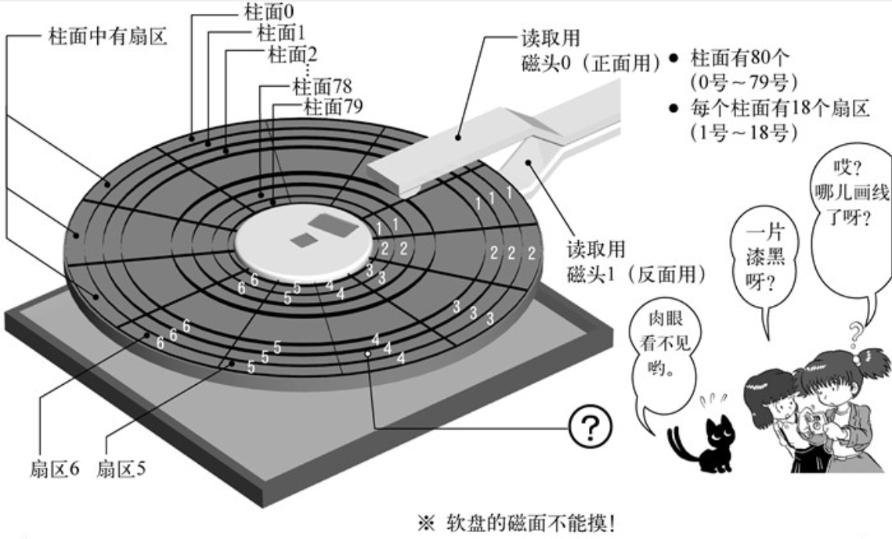

# 读取软盘内容

根据前面的内容我们知道，上电之后，根据CPU硬件电路设计，会自动将软盘第1扇区加载并执行。如果我们实现的OS只需要使用512个字节的代码，那就不需要主动读取软盘，只依靠CPU的硬件设计自动读取第1扇区就可以了。但这显然不可能。

所以接下来，我们就依靠第1扇区这512个字节的代码量，读取更多的软盘内容。

## 软盘的结构

*上图来自《30天自制操作系统》*

## 修改bootsec
